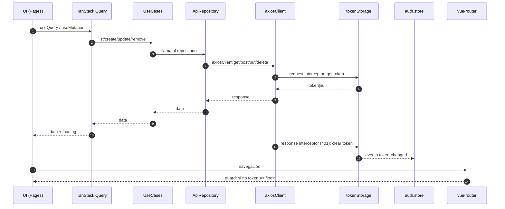

# 14 - Flujo: Axios + TanStack Query + Pinia + Vue Router

Este documento explica **cómo actúan e interactúan** Axios, TanStack Query, Pinia y Vue Router en este proyecto: **qué hace cada uno** y **en qué archivo vive**.

---

## 1) Dónde está cada cosa (mapa rápido)

### Axios

- Cliente HTTP central: `src/infrastructure/http/axiosClient.ts`
- Persistencia del token: `src/infrastructure/auth/tokenStorage.ts`
- Repositorios que llaman al backend:
  - `src/infrastructure/repositories/CategoryApiRepository.ts`
  - `src/infrastructure/repositories/ProductApiRepository.ts`
- API de login: `src/modules/auth/api/auth.api.ts`

### TanStack Query (@tanstack/vue-query)

- Registro del plugin: `src/main.ts`
- Composables de queries/mutations:
  - `src/modules/categories/composables/useCategories.ts`
  - `src/modules/products/composables/useProducts.ts`
- Keys de cache: `src/modules/shared/queryKeys.ts`
- Login como `mutation`: `src/modules/auth/pages/LoginPage.vue`

### Pinia

- Registro de Pinia: `src/plugins/pinia.ts` y `src/main.ts`
- Store de auth (estado global de token): `src/modules/auth/stores/auth.store.ts`

### Vue Router

- Definición de rutas + guard: `src/router/index.ts`
- Layout autenticado (menu + router-view hijo): `src/layouts/AuthenticatedLayout.vue`
- Root shell (router-view principal + confirm/toast global): `src/App.vue`

---

## 2) Qué hace cada uno (en este proyecto)

### Axios (cliente HTTP)

**Responsabilidad:** hacer requests HTTP al backend.

En este proyecto Axios se usa mediante una instancia central:

- `axiosClient = axios.create({ baseURL, timeout, headers })`
- `baseURL` se obtiene desde `import.meta.env.VITE_API_URL` (si no existe, usa `http://localhost:8080`).

#### Interceptores (lo importante)

En `src/infrastructure/http/axiosClient.ts` se registran:

1. **Interceptor de request**

- Antes de cada request:
  - Lee el token desde `tokenStorage.get()`.
  - Si existe, agrega `Authorization: Bearer <token>`.

1. **Interceptor de response (errores)**

- Si el backend responde `401 Unauthorized`:
  - limpia el token (`tokenStorage.clear()`).
  - re-lanza el error (`Promise.reject(error)`).

Esto implica que:

- **Todas** las llamadas que usen `axiosClient` pasan por esos interceptores.
- Si algún código usara `axios` directo (sin `axiosClient`), **no** aplicaría estos interceptores.

#### Utilidad de error

`getApiErrorMessage(error, fallback)` extrae un mensaje desde `error.response.data.message` o `error.response.data.error`.

---

### TanStack Query (estado server-side)

**Responsabilidad:** manejar datos del servidor (cache, refetch, estados loading/error, invalidaciones).

Se usa con:

- `useQuery(...)` para lecturas.
- `useMutation(...)` para escrituras.
- `useQueryClient()` para invalidar cache.

#### Ejemplo: listado + CRUD (Categorías/Productos)

En `useCategories.ts` / `useProducts.ts`:

- `useQuery({ queryKey, queryFn })` llama a `...UseCases.list()`.
- `useMutation({ mutationFn, onSuccess })` crea/actualiza/elimina.
- En `onSuccess` se hace `invalidateQueries({ queryKey })` para refrescar el listado.

**Lectura importante:**

- TanStack Query no “guarda el token”: eso lo hace Pinia/localStorage.
- TanStack Query sí mantiene el **cache** de `/categories` y `/products` y decide cuándo refetch.

---

### Pinia (estado client-side)

**Responsabilidad:** estado de aplicación del lado del cliente (en este caso, auth/token).

En `src/modules/auth/stores/auth.store.ts`:

- `token` se inicializa desde `tokenStorage.get()` (localStorage).
- `isAuthenticated` se calcula a partir de si hay token.
- `setToken(token)` actualiza el store y persiste en localStorage.
- `logout()` limpia store + localStorage.

#### Sincronización por eventos

`tokenStorage.subscribe(...)` mantiene el store sincronizado si otra parte cambia el token.

Ejemplo real:

- Si el interceptor de Axios recibe un `401` y hace `tokenStorage.clear()`, entonces:
  - se emite un evento `auth:token-changed`
  - el store escucha y actualiza `token.value = null`
  - por ende `isAuthenticated` pasa a `false`

---

### Vue Router (navegación y protección de rutas)

**Responsabilidad:** definir rutas, renderizar vistas, y controlar acceso (guards).

En `src/router/index.ts`:

- `/login` está marcada como `guestOnly`.
- Las rutas dentro del `AuthenticatedLayout` llevan `meta.requiresAuth: true`.
- `beforeEach` evalúa:
  - si requiere auth y no hay token → redirige a login con `?redirect=<ruta original>`.
  - si es guestOnly y sí hay token → redirige a principal.

**Arquitectura actual:**

- `App.vue` tiene el `RouterView` raíz.
- `AuthenticatedLayout.vue` contiene el menú y un `RouterView` interno para las páginas protegidas.

---

## 3) Flujo end-to-end (quién llama a quién)

### 3.1) Arranque de la app

1) `src/main.ts` crea la app.
2) Registra plugins:
   - `pinia`
   - `router`
   - `VueQueryPlugin`
   - PrimeVue + ToastService + ConfirmationService
3) Monta `App.vue`.

Resultado:

- Ya existe router + guard.
- Ya existe store de auth (con token inicial desde localStorage).
- Ya existe TanStack Query para queries/mutations.

---

### 3.2) Login (obtener token y navegar)

**Archivos involucrados:**

- `src/modules/auth/pages/LoginPage.vue`
- `src/modules/auth/api/auth.api.ts`
- `src/modules/auth/stores/auth.store.ts`
- `src/infrastructure/http/axiosClient.ts`
- `src/router/index.ts`

Pasos:

1) Usuario envía el formulario en `LoginPage.vue`.
2) Se ejecuta `loginMutation.mutateAsync(values)` (TanStack Query mutation).
3) `mutationFn` llama a `loginApi(payload)`.
4) `loginApi` hace `axiosClient.post('/login', payload)`.
5) Si el backend devuelve `{ token }`, `onSuccess(token)`:
   - `authStore.setToken(token)` → persiste en localStorage.
   - navega a `redirect` si venía de una ruta protegida, si no a `principal`.

Efecto secundario clave:

- Desde ese momento, **toda request HTTP** vía `axiosClient` llevará `Authorization: Bearer ...`.

---

### 3.3) Listar categorías / productos (cargar datos)

**Archivos involucrados:**

- `src/modules/categories/composables/useCategories.ts`
- `src/infrastructure/container.ts`
- `src/core/application/use-cases/category/CategoryUseCases.ts`
- `src/infrastructure/repositories/CategoryApiRepository.ts`
- `src/infrastructure/http/axiosClient.ts`

Pasos:

1) La página (ej. `CategoryPage.vue`) usa `useCategories()`.
2) `useQuery` ejecuta `queryFn: () => categoryUseCases.list()`.
3) `categoryUseCases` está construido en `container.ts` con `new CategoryApiRepository()`.
4) `CategoryApiRepository.list()` hace `axiosClient.get('/categories')`.
5) Axios agrega `Authorization` por interceptor.
6) TanStack Query cachea la respuesta bajo `queryKeys.categories.all`.

---

### 3.4) Crear / editar / eliminar (mutations + invalidación)

1) La UI ejecuta una mutation (`create/update/remove`).
2) La mutation llama al use-case y éste al repositorio.
3) Si `onSuccess` ocurre, se hace `invalidateQueries({ queryKey })`.
4) El listado se refetchea automáticamente.

---

### 3.5) Caso 401 (token inválido/expirado)

1) Una request falla con `401`.
2) Interceptor de response en `axiosClient` ejecuta `tokenStorage.clear()`.
3) `tokenStorage` emite evento `auth:token-changed`.
4) `auth.store` lo escucha y pone `token = null`.
5) En la siguiente navegación a una ruta `requiresAuth`, el guard envía a `/login`.

Nota:

- El interceptor **no navega** por sí mismo: sólo limpia token.
- La redirección la termina haciendo el guard cuando hay navegación.

---

## 4) Diagrama (resumen visual)

---

## 5) Regla práctica (para no romper el flujo)

- Para que el token y el 401 funcionen de forma consistente:
  - **Siempre** usar `axiosClient` dentro de repositorios/APIs.
- Para que la UI no se llene de lógica de fetch/cache:
  - `Pages` → usan `useCategories/useProducts`.
  - `useCases` y `repositories` no dependen de Vue.
- Para auth/navegación consistente:
  - Router decide acceso con `meta.requiresAuth` / `meta.guestOnly`.
  - Pinia decide si “hay sesión” (token).
